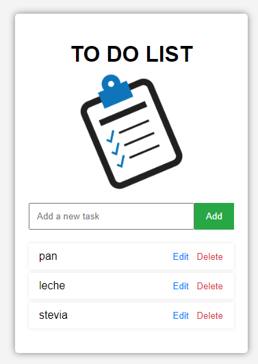

# TO DO List Application

## Descripción

Esta es una aplicación simple de TO DO List desarrollada con HTML, CSS y JavaScript puro. Permite a los usuarios agregar, editar y eliminar tareas de su lista de pendientes. Esta aplicación es ideal para aquellos que están aprendiendo los conceptos básicos de desarrollo web y quieren practicar sus habilidades de programación sin usar ningún framework.

## Funcionalidades

- **Agregar Tareas**: Los usuarios pueden agregar nuevas tareas a la lista ingresando el texto en el campo de entrada y haciendo clic en el botón "Add".
- **Editar Tareas**: Los usuarios pueden editar una tarea existente haciendo clic en el botón "Edit" junto a la tarea. Una vez en modo de edición, pueden guardar los cambios haciendo clic en el botón "Save".
- **Eliminar Tareas**: Los usuarios pueden eliminar una tarea de la lista haciendo clic en el botón "Delete" junto a la tarea.
- **Validación**: La aplicación no permite agregar tareas vacías. Si se intenta agregar una tarea sin texto, se mostrará una alerta.

## Estructura del Proyecto

- **index.html**: Contiene la estructura HTML de la aplicación.
- **styles.css**: Contiene los estilos CSS para la apariencia de la aplicación.
- **scripts.js**: Contiene el código JavaScript que maneja la lógica de la aplicación.
- **todo-list.png**: Imagen utilizada en la interfaz de la aplicación.
- **README.md**: Este archivo, que explica el propósito y la funcionalidad de la aplicación.

## Cómo Ejecutar la Aplicación

1. Clona o descarga este repositorio en tu máquina local.
2. Asegúrate de que todos los archivos (`index.html`, `styles.css`, `scripts.js`, y `image.png`) estén en el mismo directorio.
3. Abre el archivo `index.html` en tu navegador.

## Captura de Pantalla

## Contribución

Si deseas contribuir a este proyecto, por favor sigue los siguientes pasos:

1. Haz un fork del repositorio.
2. Crea una nueva rama (`git checkout -b feature/nueva-funcionalidad`).
3. Realiza los cambios necesarios y haz commit (`git commit -am 'Agrega nueva funcionalidad'`).
4. Sube tus cambios (`git push origin feature/nueva-funcionalidad`).
5. Crea un nuevo Pull Request.

## Autor

Esta aplicación fue desarrollada por [Tu Nombre].

## Licencia

Este proyecto está licenciado bajo la Licencia MIT - consulta el archivo [LICENSE](LICENSE) para más detalles.
